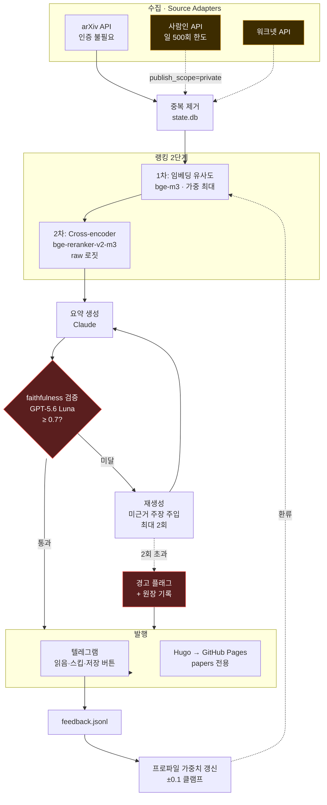
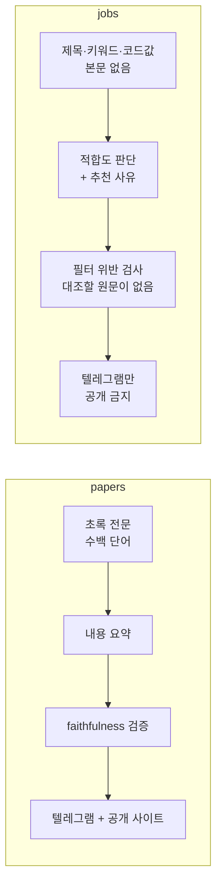
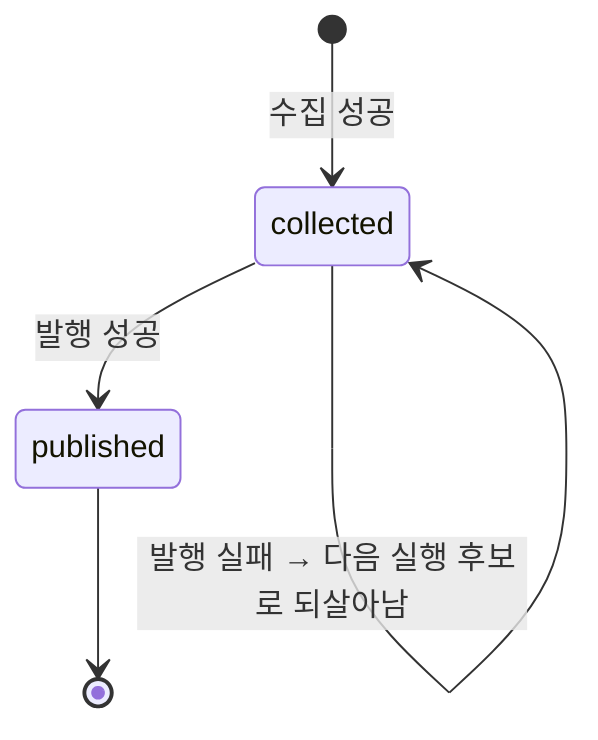
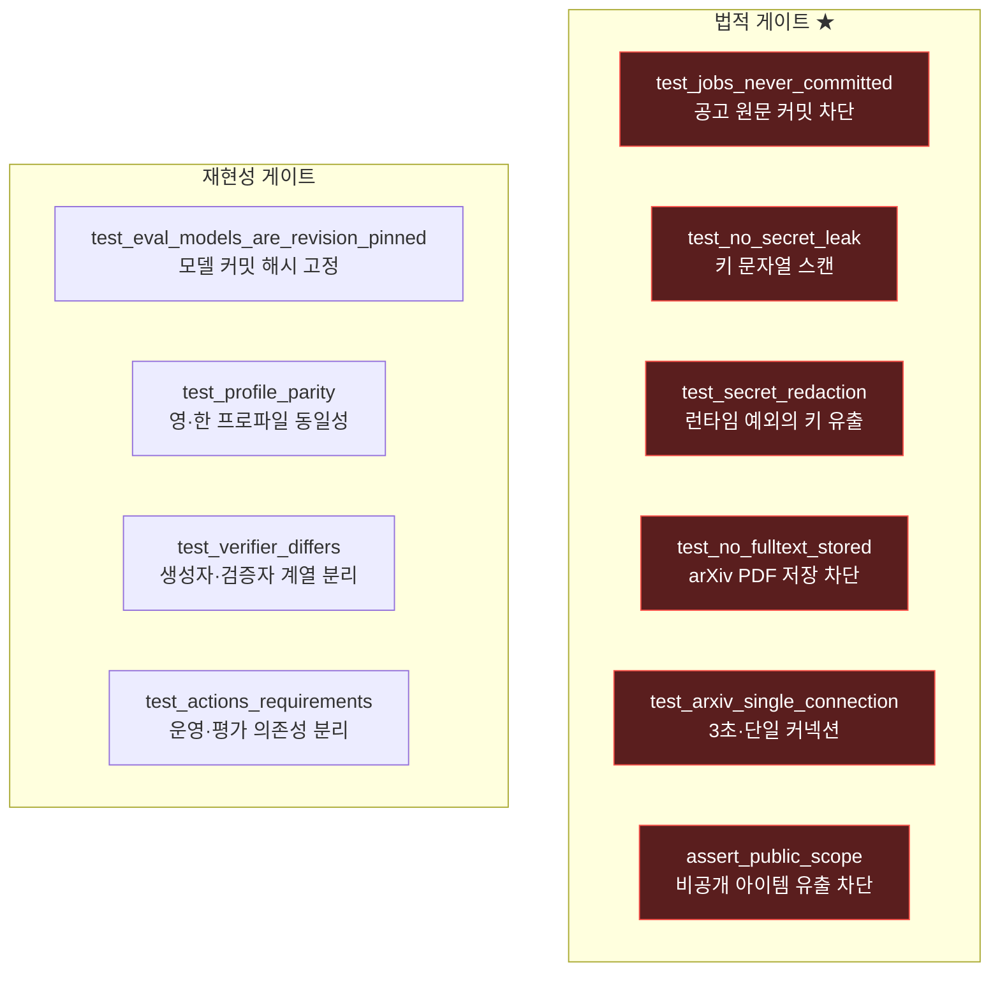
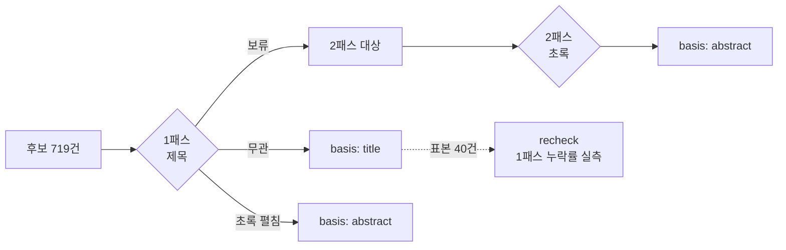

# Radar 아키텍처

> 도식은 GitHub에서 그대로 렌더링됩니다. 텍스트라 diff 가 남고, 코드가 바뀌면 같이 고칩니다.

## 1. 전체 파이프라인

**빨간색 = 게이트** (통과 못 하면 진행이 막힘) · **노란색 = 비공개 전용** (공개 싱크 도달 시 예외)

## 2. 채널이 갈리는 세 지점

두 채널은 같은 파이프라인을 쓰지만 **세 곳에서 반드시 갈립니다.** 섞으면 법적 문제가 됩니다.

사람인 API는 **직무내용 본문을 반환하지 않습니다.** 대조할 원문이 없으므로 faithfulness 지표가
성립하지 않습니다 — 그래서 jobs 에는 붙이지 않고 하드 필터 위반 검사로 대체합니다.

## 3. 아이템 수명주기 (하루치 유실 방지)

`collect` 직후를 "끝"으로 마킹하면, 전 구간 실행에서 발행이 실패한 날의 아이템이
영영 후보에 오르지 못합니다. Actions 크론은 반드시 실패하는 날이 오므로 수집과 발행을
분리했습니다.

## 4. 게이트 지도

`test_no_secret_leak` 은 **파일에 하드코딩된** 키만 잡습니다. 런타임에 예외를 타고
나가는 키는 못 잡아서 `test_secret_redaction` 을 따로 뒀습니다 — 실제로 봇 토큰이
공개 원장으로 새는 경로를 찾아 막은 뒤 추가한 게이트입니다.

## 5. 골드셋 라벨링 (평가 정답셋)

`basis` 를 남기는 이유: 제목만 보고 내린 판정과 초록까지 읽고 내린 판정을 구분해야
"제목 트리아지가 몇 %를 놓치는가"를 나중에 **측정**할 수 있습니다. 추정이 아니라 수치로.
